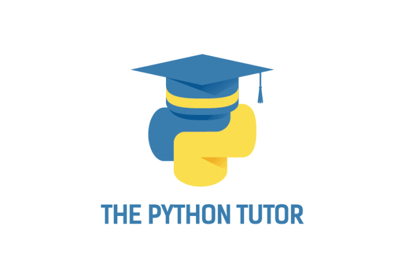
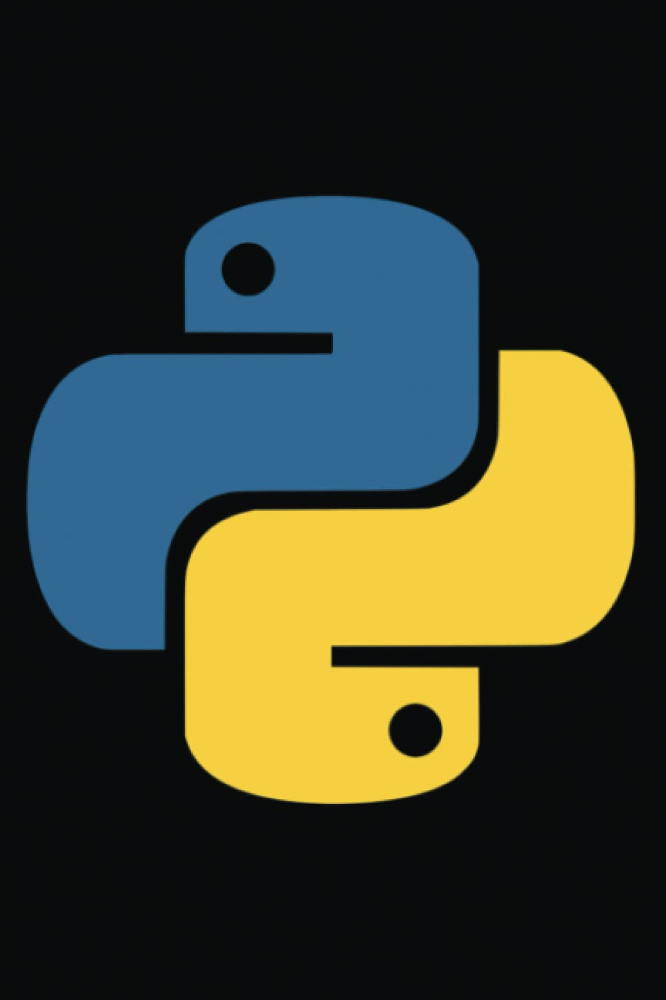

# 🐍 Módulo Final: Datos Curiosos de Python y Despedida



¡Llegaste al final! Pero antes de que te vayas a conquistar el mundo con Python, déjame contarte algunos **datos súper curiosos** que probablemente no sabías sobre este hermoso lenguaje.

---

## Datos Curiosos que te Volarán la Mente

### **1. El Zen de Python (Easter Egg Secreto)**
¿Sabías que Python tiene filosofía propia? Escribe esto en tu terminal:

```python
import this
```

**Resultado:** Aparecerán los 19 principios del "Zen de Python" por Tim Peters. Mi favorito:
> *"Simple is better than complex."* (Lo simple es mejor que lo complejo)

---

### **2. Python es MÁS VIEJO que JavaScript**
- **Python:** Creado en **1991**
- **JavaScript:** Creado en **1995**

Sí, Python ya existía cuando JavaScript ni siquiera era un sueño. ¡Respeta a tus mayores!

---

### **3. El Logo de Python Tiene un Secreto**


Las dos serpientes del logo **NO** representan serpientes cualquiera. Representan:
- **Azul:** Python 2
- **Amarillo:** Python 3

¡Era una metáfora de la transición todo el tiempo!

---

### **4. Empresas GIGANTES que Usan Python**
| Empresa | ¿Para qué lo usan? |
|---------|-------------------|
| **Netflix**  | Algoritmos de recomendación |
| **Instagram**  | Backend completo (Django) |
| **Spotify**  | Análisis de datos musicales |
| **NASA**  | ¡Misiones espaciales! |
| **Google**  | YouTube, Gmail, Maps |
| **Uber**  | Algoritmos de rutas |

**Dato loco:** Instagram maneja **400 millones** de usuarios con Python. ¿Todavía crees que Python es "lento"?

---

### **5. El Creador de Python Trabajó en Google**
**Guido van Rossum** (el papá de Python) trabajó en Google de 2005 a 2012. Ahí ayudó a desarrollar herramientas internas con Python.

Después se fue a **Dropbox** (2013-2019) y ahora está en **Microsoft** desde 2020. ¡El tipo es una leyenda viviente!

---

### **6. Python en el Espacio **
NASA usa Python para:
- Controlar el **Telescopio Espacial Hubble**
- Misiones a **Marte** (rovers)
- Análisis de datos de **satélites**

**Fun fact:** Si hay vida en Marte, probablemente la encontremos gracias a Python

---

### **7. ¿Por Qué se Llama Python?**
**NO** es por la serpiente. Guido van Rossum era fanático del grupo cómico británico **"Monty Python's Flying Circus"**.

**Ejemplo real del humor de Monty Python en Python:**
```python
# Esto funciona de verdad
import antigravity  # Abre una tira cómica de xkcd sobre Python
```

---

### **8. Python Tiene Sus Propios "Comandos Secretos"**
```python
# Easter eggs escondidos
import this          # Zen de Python
import antigravity   # Tira cómica
import __hello__     # Saludo secreto

# Operadores raros pero útiles
print("Hola" * 3)           # HolaHolaHola
print([1, 2] * 2)           # [1, 2, 1, 2]
print("a" in "Python")      # False
print("on" in "Python")     # True
```

---


### **9. Python 2 vs Python 3: La Guerra Civil**
La transición de Python 2 a Python 3 tomó **más de 10 años** (2008-2020).

**¿Por qué tanto drama?**
```python
# Python 2
print "Hola"          # Funciona
print("Hola")         # También funciona

# Python 3  
print "Hola"          # ERROR
print("Hola")         # Solo esto funciona
```

**Python 2 oficialmente murió** el 1 de enero de 2020. RIP

---

### **10. Python en Videojuegos**
¿Sabías que estos juegos usan Python?

- **Civilization IV** (lógica del juego)
- **World of Tanks** (servidores)
- **Eve Online** (backend)
- **Battlefield 2** (scripts)

---

### **11. La Comunidad Más Genial**
Python tiene la comunidad más **acogedora** del mundo de la programación:

- **PyCon:** Conferencia mundial de Python
- **PyLadies:** Comunidad de mujeres pythonistas  
- **Python.org:** Todo es **gratis** y **open source**
- **PSF:** Python Software Foundation mantiene todo funcionando

**Lema no oficial:** *"Los pythonistas somos gente bonita"*

---

### **12. Records Mundiales de Python**

| Record | Descripción |
|--------|-------------|
| **Línea más corta** | `0` (cero, es código válido) |
| **Programa más corto útil** | `print("Hi")` (11 caracteres) |
| **Empresa más grande** | Instagram (400M usuarios) |
| **Proyecto open source** | Linux kernel usa Python para builds |

---

### **13. El Futuro de Python**
**¿Qué viene después?**

- **Python 3.12:** Mejor rendimiento (+15% más rápido)
- **Python 3.13:** Sin GIL (Global Interpreter Lock) - ¡Por fin multithreading real!
- **Python 4.0:** Aún no existe (y probablemente no por mucho tiempo)

---

## ¡Felicidades, Graduado/a!

### **Has Completado el Curso de Python** 

**Lo que aprendiste:**
- Sintaxis básica y variables
- Estructuras de control (if, loops)
- Funciones y módulos
- Listas, diccionarios y tuplas
- Manejo de errores y archivos
- Programación orientada a objetos
- Interfaces gráficas con Tkinter
- Machine Learning con Scikit-learn
- Análisis de datos con Pandas
- Visualización con Matplotlib

---

### **¿Qué Hacer Ahora?**

#### **Proyectos para Practicar:**
1. **Bot de Discord/Telegram** - Automatiza tareas divertidas
2. **Web Scraper** - Extrae datos de páginas web
3. **API REST** - Crea tu propio servicio web
4. **Juego con Pygame** - ¡Snake, Tetris, Pong!
5. **Dashboard de datos** - Analiza datos reales
6. **Chatbot con IA** - Integra OpenAI o Hugging Face

#### **Librerías para Explorar:**
```python
# Web Development
django          # Framework web completo
flask           # Framework web ligero
fastapi         # APIs modernas y rápidas

# Data Science  
numpy           # Cálculos numéricos
pandas          # Manipulación de datos
matplotlib      # Gráficos básicos
seaborn         # Gráficos estadísticos
plotly          # Gráficos interactivos

# Machine Learning
scikit-learn    # ML tradicional
tensorflow      # Deep Learning
pytorch         # Deep Learning (más flexible)
opencv          # Visión por computadora

# Automatización
selenium        # Automatizar navegadores
requests        # Peticiones HTTP
beautifulsoup   # Web scraping
schedule        # Tareas programadas

# Gaming
pygame          # Juegos 2D
arcade          # Juegos más modernos
```

---

### **Mensaje Final**

Querido/a pythonista,

Has completado un viaje increíble. Desde tu primer `print("Hola mundo")` hasta machine learning y interfaces gráficas. **¡Eso no es poca cosa!**

**Recuerda siempre:**
- Python es **poderoso** pero **simple**
- La comunidad siempre está para ayudar
- Los proyectos pequeños se vuelven grandes
- La práctica hace al maestro
- **"Code is read more than it is written"**

### **No es una despedida, es un "hasta luego"**

Python estará ahí cuando lo necesites. Para automatizar tareas aburridas, analizar datos interesantes, crear aplicaciones increíbles o simplemente para divertirte programando.

**Tu aventura con Python apenas comienza.**

---

### **🔗 Recursos para Seguir Aprendiendo**

#### **Documentación Oficial:**
- [python.org](https://python.org) - La biblia de Python
- [docs.python.org](https://docs.python.org) - Documentación técnica

#### **Comunidades:**
- [Reddit: r/Python](https://reddit.com/r/Python) - Noticias y discusiones
- [Stack Overflow](https://stackoverflow.com/questions/tagged/python) - Resuelve dudas
- [Discord Python](https://discord.gg/python) - Chat en tiempo real

#### **Práctica:**
- [LeetCode](https://leetcode.com) - Problemas de programación
- [HackerRank](https://hackerrank.com) - Desafíos Python
- [Codewars](https://codewars.com) - Katas de programación
- [Project Euler](https://projecteuler.net) - Problemas matemáticos

#### **Cursos Avanzados:**
- [Real Python](https://realpython.com) - Tutoriales profundos
- [Automate the Boring Stuff](https://automatetheboringstuff.com) - Automatización práctica
- [Full Stack Python](https://fullstackpython.com) - Desarrollo web completo

---

**¡Happy coding!**

---

*"La vida es muy corta para programar en C."* - **Guido van Rossum**

**¿Tu próximo lenguaje?** No importa. Una vez que dominas Python, cualquier lenguaje se vuelve más fácil.

---

### **CERTIFICADO MENTAL**

 **ESTE CERTIFICADO MENTAL OTORGA QUE:**

**[TU NOMBRE AQUÍ]**

**Ha completado exitosamente el Curso de Python y ahora es oficialmente un/a PYTHONISTA CERTIFICADO/A**

*Fecha: Hoy*  
*Válido: Para siempre*  
*Superpoder: Hacer que las computadoras obedezcan*

---

### **Mantente en Contacto**

Si algún día necesitas ayuda, tienes una duda o quieres presumir tu proyecto:

**Recuerda:** La comunidad Python siempre está aquí para ti. ¡Nunca estás solo/a programando!

**¡Hasta la próxima aventura de código!**

---

```python
# Tu primer día como pythonista graduado
import time

while True:
    print("¡Soy un pythonista!")
    time.sleep(86400)  # Recordarlo cada día
```

## @MAU OSORIO